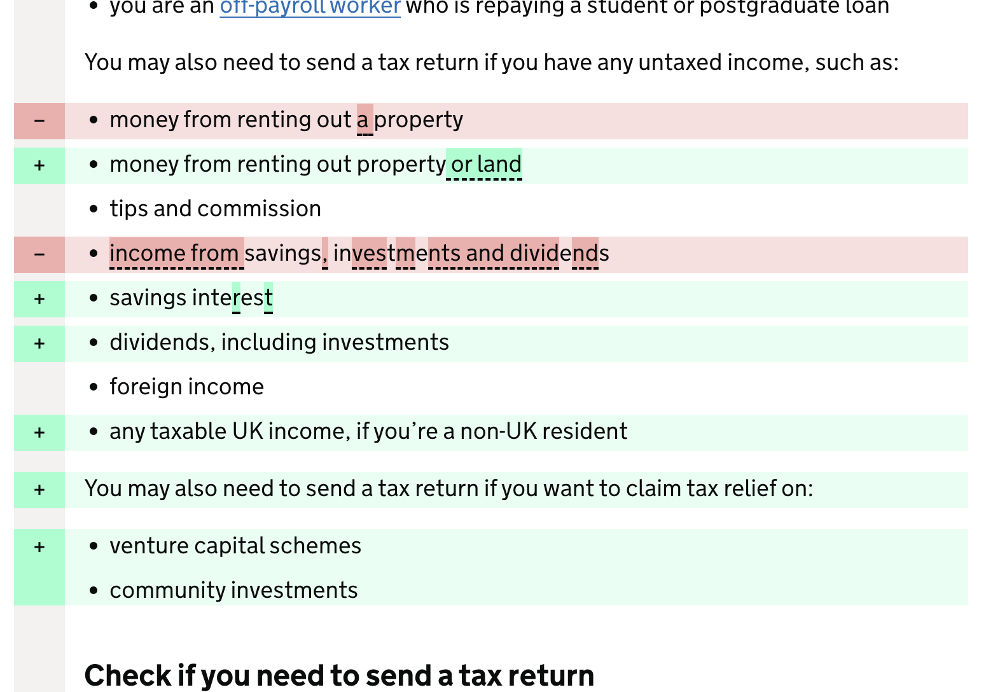
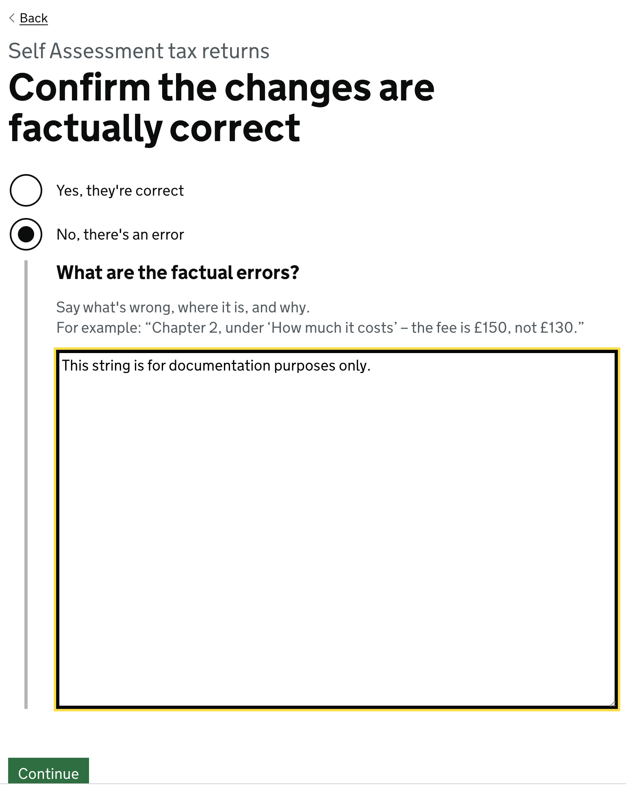
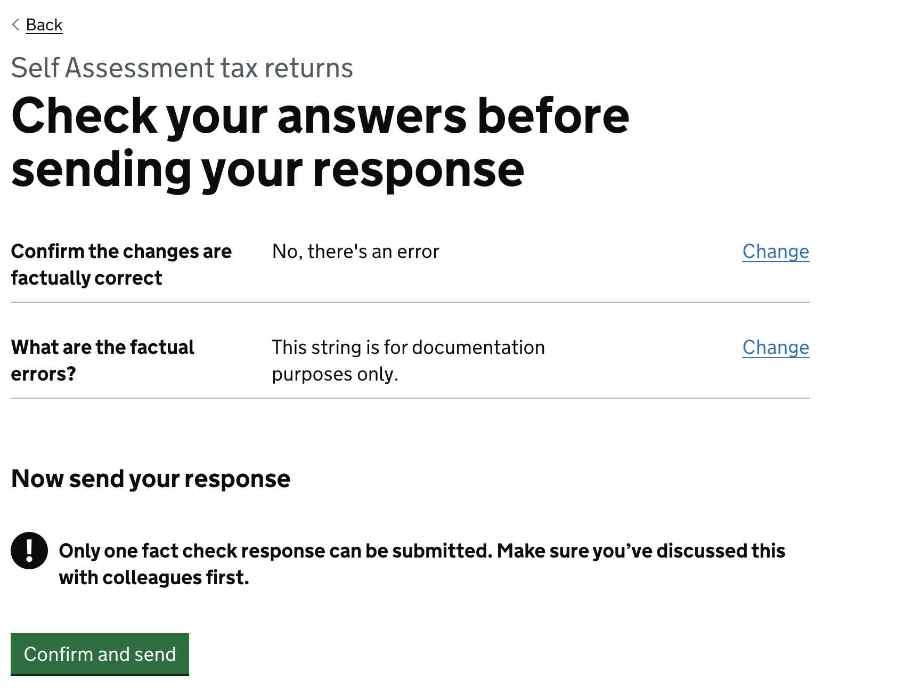
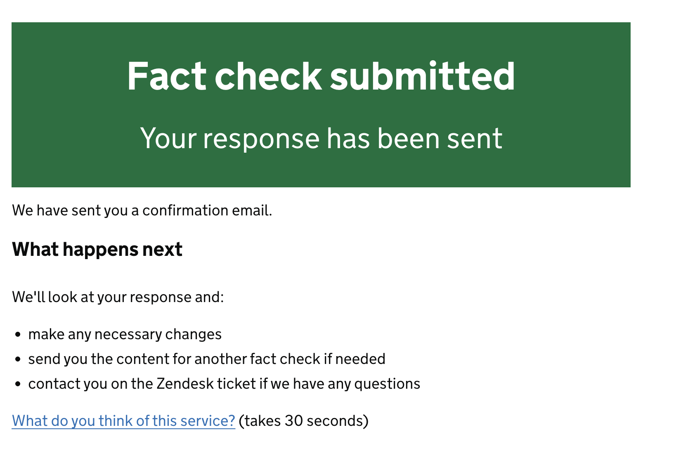
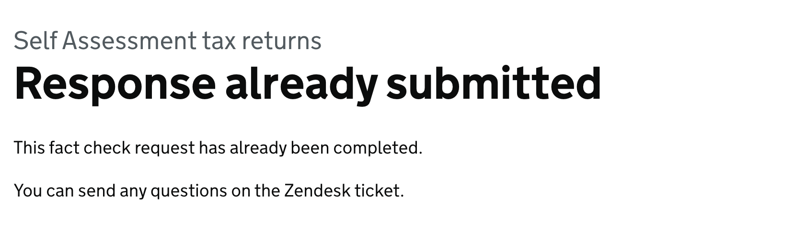

<<<<<<< Updated upstream
=======
# The Fact Check Flow

Fact Check Manager (FCM) is designed to allow easy sharing of changes for any given document from any given app assuming the
API requirements are met.

This page describes the flow of a given Fact Check Request from the user side in FCM only and
does not deal with the backend handling of these requests. For information on the API, check 
[the API reference](api-reference.md).

## Initial Request
When a fact check request is made from the initial application, outside of FCM, a new page is created within FCM that
can be linked to from anywhere. 

However, there are measures in place to ensure that only the user who sent the request,
as well as the recipients of that request, are able to read and respond. All other users will be unable to
view its contents and will instead see an error when trying to load the page.

TODO: Discuss access permissions?

## The Diff View
When a user with access arrives on the request page, they will be shown a view indicating the changes made. This diff 
view contains all of the original formatting from the original document, and indicates where new content has been added,
old content has been removed, and what content has been explicitly changed including the formatting.

By default, the removed content is red, the new content is green. Explicit minor changes to words and spellings are
highlighted.

The Diff is capable of showing either a whole content block, or separate content blocks, depending on how the source 
application sends the data to FCM. Regardless, the process is the same for changes.

> **Note:** If there is no previous version to compare to, the diff view will only show the current content without any
> formatting. This is by design, as there is no prior document from which changes have been made.

Once the user has considered the changes (or the whole document in the case of a new release), and they have the 
permissions required to respond, they can move onto the response view.

## Response View
The response view is a simple page giving the user the option to approve the changes with no modifications needed, or to
flag any further changes with a note.

> **Note:** The large text box allowing input is only displayed when a further change is requested.

## Confirmation View

The user will then be given the chance to confirm their response before submission. Once the "Confirm and send" button
is pressed, FCM will attempt to send the response to the original application that sent the FCM request in the first place,
notifying the requester.

## Response Sent View

There are two potential outcomes once the "Confirm and send" button has been pressed.

### Successful Response
Assuming there are no errors at all, the user will be presented with a success message explaining what the next steps are:

It is at this stage that FCM sends all the information back to the application that made the original request.

### Unsuccessful Response
If there is an error wherein the response has already been sent - likely due to another user getting there ahead of time,
then the user is informed of such and told to ask any further questions on the relevant Zendesk ticket.

At this point, the flow is completed from the user side, and everything else is handled by the source application.

> **Note:** There is a chance another error may occur at this stage. At which point a generic error message is shown to the user
> indicating something went wrong, and the user may try again. This may be reported by users in the relevant Zendesk ticket.
>>>>>>> Stashed changes
